# Progetto E-Commerce di chiavi digitali

## Tecnica di sviluppo software, MODELLO A CASCATA

Nello sviluppo di questo software e' stata utilizzata la tecnica del modello a cascata, che parte dalla definizione dei requisiti, fino ad arrivare allo sviluppo effettivo del prodotto con conseguente rilascio al cliente.  
In questo caso l'attenzione alla **fase di definizione dei requisiti** e' massima in quanto rappresenta la parte cruciale del progetto, dalla quale si possono propagare gli **errori piu' gravi**, che possono portare a una grande difficolta' nella loro possibile correzione.  

## Breve descrizione

Si vuole realizzare un sistema per la vendita di chiavi digitali tramite un E-Commerce online, che offra un'interfaccia semplice per l'utente riguardo l'acquisto; ai vari dipendenti e all'admin per la gestione del magazzino. Quest'ultimo sarà rifornito grazie a un rivenditore terzo con cui il sistema comunica direttamente.

## **FASE DI ANALISI**

## Requisiti funzionali

- Il Sistema deve permettere all'utente di ricercare gli articoli tramite **filtri appositi**
- Il Sistema deve consentire la **registrazione** e il **login** all’Utente.  
- L’Utente deve poter visualizzare lo **storico acquisti**, le **notizie** e le **offerte**
- Il Sistema deve permettere l'acquisto degli articoli sia all'utente **loggato** sia a un **guest**  
- Il Sistema deve mettere a disposizione un meccanismo di gestione degli articoli da comprare (**carrello acquisti**), che viene gestito diversamente a seconda del **tipo di utente**  
- Il Sistema deve fornire una funzione per il **ri-acquisto** di carrelli passati, tramite la sezione di **storico** 
- Il sistema deve accettare **metodi di pagamento diversificati** (carta prepagata, carta di debito/credito ecc...).    
- Il dipendente può **modificare il catalogo** del sistema in ogni suo aspetto (**Grafica** e **contenuto**).    
- Il Sistema deve **avvisare** il dipendente nel caso di prodotti esauriti.	<!-- casella prodotti esauriti nella pagina del profilo del dipendente--> 
- Il dipendente deve poter **rifornire** il sistema in base alle **chiavi mancanti**
- L'Admin deve poter aggiungere e rimuovere **nuove tipologie** di chiavi digitali
- L'Admin gestisce la registrazione dei vari **dipendenti** nel sistema
- (Per semplicità) Il Fornitore accetta gli stessi metodi di pagamento del Sistema.   

## Requisiti non funzionali

- La transazione deve essere altamente sicura
- Il prodotto deve essere consegnato in breve tempo (~3 min. max.)
- La piattaforma deve essere funzionante 24/7

## Attori
- Utente
- Dipendente
- Admin
- Fornitore (attore secondario)
- Circuiti di pagamento (attore secondario)

## Glossario 
- Data1: Database del sistema con prodotti e credenziali
- Data2: Database fornitore
- Logged: visualizzazione utente registrato
- Manager: visualizzazione dipendente registrato
- Sinonimi: "prodotto", "articolo", "chiave digitali"
- Sinonimi: "negozio", "store", "piattaforma"
- Time-Out: in seguito all'input inserito si trascorre troppo tempo in attesa del relativo output

## Casi D'uso
| ID  | Nome caso d'uso | Attori  | Descrizione | Trigger | Precondizioni | Post condizioni  | Eccezioni | Include |
|-----------|-----------|-------------|---------------|-----------------|-----------------|---------------|-----------------|----------------|
| 01  | Modifica rappresentazione sistema     | Utente  | L'utente sfoglia gli articoli e modifica la visione tramite i filtri  |  Interazione dell'utente   |  //  |  modifica interfaccia visualizzata  |   Time-Out   |     //   |
|02| Registrazione| Utente| l'utente effettua una nuova registrazione al sistema| Click su pulsante di registrazione| Utente non ancora registrato| Logged | Time-Out, Account già esistente|  //|
|03| Login| Utente, Dipendente, Admin| L'Utente/Dipendente/Admin accede al sistema| Click sul pulsante di accesso| Account già esistente| Logged | Time-Out, Account non esistente| 02 |
|04| Visualizzazione Profilo| Utente| L'utente visualizza informazioni personali e ne può modificare alcune| Click nella sezione Profilo|Logged | // |  Time-Out  | // |
|05| Aggiunta Articolo| Utente| L'utente aggiunge un articolo al carrello| Interazione dell'utente con bottone|// | Modifica carrello|  Time-Out, Articolo esaurito|  //|
|06| rimozione articolo| Utente| l'utente rimuove un articolo dal carrello| interazione col carrello| almeno un articolo nel carrello| modifica carrello | Time-Out, Articolo non piu presente|// |
|07| Pagamento Utente| Utente, Circuito di pagamento| l'utente deve  pagare con un circuito di pagamento a scelta| Interazione utente con procedura di pagamento| almeno un articolo nel carrello| modifica carrello, modifica data1 | Time-Out, errore pagamento, Pagamento cancellato |  //|
|08| Modifica sistema| Dipendente| Il Dipendente modifica il catalogo nella grafica e nei contenuti| Accesso ad area di modifica| Logged| Modifica interfaccia sistema e/o data1|Time-Out|  //|
|09| Acquisto da fornitore| Dipendente, Admin, Fornitore, Circuito di pagamento| Il Dipendente/admin acquista dal fornitore chiavi digitali| click su bottone|Logged  |Aggiornamento catalogo|Time-Out, Articolo non presente, cancellazione pagamento|   07  |  
|   10    |   Visualizzazione del carrello    |   Utente    |   Rappresentazione degli articoli nel carrello    |   Interazione dell'utente con l'opzione carrello    |   // |   //  |   Time-Out   |  //    |
|   11  |  Registrazione dipendenti |  Admin   |   Registrazione di nuovi dipendenti al sistema   |    interazione con funzione registrazione  |    Logged    |   Aggiornamento lista dipendenti    |   Time-Out, ID dipendente già presente  |  02    |
| 12 | Cancellazione dipendenti | Admin | L'admin sceglie di rimuovere un dipendente dal sistema | Interazione con apposita funzione | Logged | Aggiornamento lista dipendenti | Time-Out, ID dipendente non presente| //|
| 13 | Aggiunta nuovo articolo | Admin | L'admin inserisce nel catalogo nuovi articoli | Interazione con apposita funzione | Logged | Aggiornamento catalogo| Time-Out, articolo già presente | 09 |
| 14 | Acquisto carrelli passati | Utente | Il cliente acquista nuovamente degli articoli già acquistati | Interazione con funzione di ri-acquisto | Logged, Storico non vuoto | Aggiornamento carrello | Time-Out | //|

### Normal flow dei casi d'uso

### 01

1. L'utente si connette ad internet
2. L'utente cerca il negozio su browser
3. L'utente apre la piattaforma
4. La piattaforma carica la visualizzazione
5. L'utente sceglie il filtro che preferisce per la visualizzazione degli articoli
6. Il sistema ricalcola la visualizzazione degli articoli includendo solo quelli che soddisfano i filtri
7. Il sistema mostra la nuova visualizzazione della piattaforma

### 02

1. La piattaforma ha già caricato la visualizzazione, con o senza filtri
2. L'utente clicca sul bottone di **registrazione**
3. La piattaforma apre una finestra di registrazione in cui sono presenti dei campi da riempire
4. L'utente riempie i campi con le proprie informazioni personali 
   - nome
   - cognome
   - email
   - password
   - conferma password
5. L'utente clicca il bottone di **conferma**
6. Il sistema memorizza le informazioni sul Data1
7. Il sistema chiude la finestra di registrazione
8. Il sistema ritorna sulla finestra di visualizzazione articoli come da inizio procedura, aprendo una finestra di **conferma avvenuta registrazione**

#### Alternative flow

6. Il sistema trova una corrispondenza già esistente nel data1
7. Il sistema ripropone la finestra di registrazione
8. Il sistema aggiunge un avviso a schermo che specifica l'esistenza di un profilo con la **stessa mail**
  
### 03

(Attore = Dipendente/Utente) (Il flow per il dipendente è valido anche per l'Admin)
1. La piattaforma ha già caricato la visualizzazione, con o senza filtri
2. L'attore clicca sul bottone **accedi** 
3. Il sistema apre una finestra di accesso con i campi da riempire
4. L'attore inserisce i propri dati nei campi
     - email
     - password
5. Dopo aver premuto **accedi** i campi riempiti vengono mandati al Data1
6. Il Data1 controlla che i dati inseriti siano corretti e fa accedere l'attore al sistema
7. Il sistema chiude la finestra di accesso
8. In base al profilo dell'attore viene mostrata un diversa visualizzazione della piattaforma:
  - Utente -> visualizzazione **Logged**
  - Nuove funzioni:
    - Aggiunta dell'opzione **profilo**
    - **rimozione opzioni di registrazione**-> accedi, registrati
  - Dipendente -> visualizzazione **Manager**
  - Nuove funzioni:
    - Modifica della visualizzazione home page
    - Gestione Inventario
    - Ordine chiavi da fornitore
    - **rimossa opzione** carrello
    - **rimosse opzioni di registrazione**-> accedi, registrati

#### Alternative flow

6. Il sistema non trova riscontro nel data1 rispetto ai dati inseriti
7. Il sistema ripropone la schermata d'accesso
8. Il sistema aggiunge un avviso a schermo che specifica la mancanza di un'account associato alla coppia **mail/password** inserita

### 04

1. L'utente ha già eseguito il login
2. La piattaforma apre la finestra del **profilo**
3. la finestra presenta diverse opzioni
     - **storico acquisti**: Il sistema fa visualizzare una nuova finestra all'utente, in questa sono presenti tutti gli acquisti passati, con le varie informazioni associate (**data acquisto**, **nome articolo**, **prezzo articolo**)
  
    - **notizie e offerte**: Il sistema fa visualizzare una nuova finestra all'utente, in questa vi sono tutte le notizie riguardanti nuovi articoli presenti nella piattaforma e offerte sui prodotti disponibili in quel momento
  
    - **modifica informazioni personali**: Il sistema fa visualizzare una nuova finestra all'utente, nella quale sono presenti diversi bottoni con cui l'utente può interagire, che permettono di cambiare alcune informazioni personali(**password**, **indirizzo di fatturazione**, **metodi di pagamento**)
4. una volta aperta la rispettiva finestra questa presenta un opzione per tornare indietro alla pagina del profilo

### 05

1. La piattaforma ha già caricato la visualizzazione, con o senza filtri
2. a questo punto l'utente sceglie l'articolo che vuole aggiungere al carrello
3. l'utente interagisce col bottone **aggiungi al carrello**
4. Il sistema comunica col **data1** per controllare la disponibilità dell'articolo
5. viene confermata la disponibilità da parte del data1
6. Il sistema aggiorna la visualizzazione dell'utente modificando l'icona del carrello ed il suo contenuto

#### Alternative flow

5. non viene confermata la disponibilità da parte del data1
6. Il sistema aggiorna la visualizzazione dell'utente modificando l'etichetta dell'articolo in questione
7. Il sistema notifica ai dipendenti/admin che il prodotto è esaurito

### 06

1. L'utente, tramite la relativa icona, accede alla **visualizzazione del carrello**
2. l'utente sceglie l'articolo da rimuovere e interagisce col bottone **rimuovi**
3. Il sistema aggiorna la visualizzazione del carrello ed il suo contenuto rimuovendo l'articolo in questione e mantenendone eventuali altri

#### Alternative flow 

3. Il sistema non trova l'articolo nel carrello
4. Il sistema aggiorna la visualizzazione del carrello, con un avviso a schermo che indica l'errore di **articolo non piu' presente**

### 07 (alternative flow incluso)

1. L'utente, tramite apposita icona, accede alla sezione **carrello**
2. L'utente procede all'acquisto tramite bottone dedicato
3. Viene mostrata una finestra con tutti i metodi di pagamento disponibili
4. L'utente ne sceglie uno
5. Vengono mostrati i campi da riempire con le relative informazioni
6. L'utente inserisce i dati
7. Il circuito di pagamento verifica la correttezza dei dati:
     - In caso negativo lo notifica al sistema che ne permette il reinserimento
     - In caso affermativo processa la transazione
8. Il circuito di pagamento verifica il saldo disponibile:
     - Se è sufficiente, il circuito di pagamento conferma la transazione detraendo la somma in questione e lo notifica al sistema che si occupa di inviare i/il prodotti/o al cliente
     - Se non è sufficiente, il circuito di pagamento lo notifica al sistema che visualizza una finestra apposita; l'utente viene reindirizzato alla scelta dei metodi di pagamento
9. Dopo l'acquisto l'utente viene riportato alla schermata del carrello
10. Il data1 viene aggiornato in base ai prodotti che sono stati acquistati e quindi vengono eliminati da quelli disponibili

### 08

1. Il Dipendente si collega al negozio tramite browser
2. Il sistema mostra la visualizzazione normale
3. Il Dipendente accede con le proprie credenziali tramite il bottone **Accedi**
4. Il sistema riconosce il Dipendente dalle credenziali inserite
5. Viene mostrata la visualizzazione **Manager** dello store
6. il dipendente entra nella sezione di **Modifica** tramite apposito bottone
7. Vengono mostrate nuove opzioni:
   - Modifica prodotti disponibili (prezzo, quantità e rimozione)
   - Aggiunta nuovi prodotti
   - Modifica grafica del negozio
8. In base alle modifiche apportate viene modificato data1
9. Al termine delle modifiche viene visualizzata un'anteprima dello store

### 09 

(Attore = Dipendente e Admin)
1. L'attore è già loggato
2. L'attore, tramite sezione apposita, accede al data2 del fornitore
3. In base alla tipologia di articoli presenti già nel data1, vengono visualizzati solo i rispettivi prodotti del data2
4. L'attore sceglie quali e quante chiavi acquistare
5. L'attore conferma gli articoli selezionati
6. Viene ripetuta la procedura del caso d'uso 07 a partire dal passo 3 al passo 8
7. Viene aggiornato il data1 (aggiungendo gli articoli acquistati) e il data2 (rimuovendo gli articoli acquistati)
8. L'attore viene riportato alla visualizzazione iniziale del data2

### 10

1. L'utente è già loggato
2. L'utente accede al carrello tramite relativa icona
3. Il sistema modifica la visualizzazione della pagina mostrando gli articoli nel carrello

### 11

1. L'admin accede alla sua area personale
2. L'admin interagisce con il bottone per la registrazione di nuovi dipendenti al sistema
3. Il sistema richiede di inserire le informazioni personali del dipendente, oltre al **nome utente** e la **password** che dovrà successivamente utilizzare
4. Dopo una verifica del sistema dei dati inseriti dall'admin il nuovo profilo viene creato
5. Il sistema riporta l'admin alla schermata del suo profilo e crea una finestra con il messaggio di avvenuta registrazione

#### Alternative flow

5. Il sistema riporta l'admin alla finestra di registrazione dipendenti, con un avviso il quale informa che l'utente e' già presente

### 12

1. L'admin accede alla sua area personale
2. L'admin interagisce con il bottone per la delezione di un profilo dalla piattaforma (che sia di un utente o un dipendente)
3. Il sistema offre una barra di ricerca all'admin, con cui potrà ricercare il profilo da eliminare, tramite **email** o **nome utente**
4. Il sistema gli presenta una lista dei riscontri che ha avuto in base alle informazioni inserite
5. L'admin sceglie l'account con opportuna interazione tramite bottone
6. Il sistema elimina definitivamente il profilo dal data1
7. Il sistema riporta l'admin alla schermata del suo profilo e crea una finestra con il messaggio di avvenuta delezione

#### Alternative flow

6. Il sistema non trova piu' riscontro dell'utente nel sistema
7. Il sistema riporta l'admin alla schermata di delezione, con un avviso il quale informa che l'utente non e' presente

### 13

1. L'admin è già loggato
2. L'admin accede alla sua area personale
3. Tramite apposito comando, l'admin visualizza una lista completa dei prodotti in catalogo
4. L'admin aggiunge una nuova voce alla lista inserendo il nuovo prodotto (**rifacendosi al caso d'uso 09**)
5. Il sistema controlla che il prodotto non sia già presente (confrontando ID)
6. Il sistema visualizza un messaggio di conferma

### 14

1. Il cliente e' già logged
2. Il cliente accede alla sua sezione dello storico acquisti
3. Il cliente sceglie un ordine da comprare nuovamente e interagisce con il bottone per il ri-acquisto
4. Il sistema popola il carrello con gli articoli dell'ordine scelto

#

## **FASE DI PROGETTAZIONE**

Una volta definiti i requisiti in fase di Analisi bisogna definire come questi saranno soddisfatti.  
A questo livello, viene definita la struttura complessiva del sistema in base ai moduli principali di cui è composto e alle relazioni che li legano.

## **Diagramma dei casi d'uso**
I diagrammi dei casi d'uso sono usati durante l'esplicitazione dei requisiti per rappresentare comportamenti esterni.  
Di seguito degli esempi:  

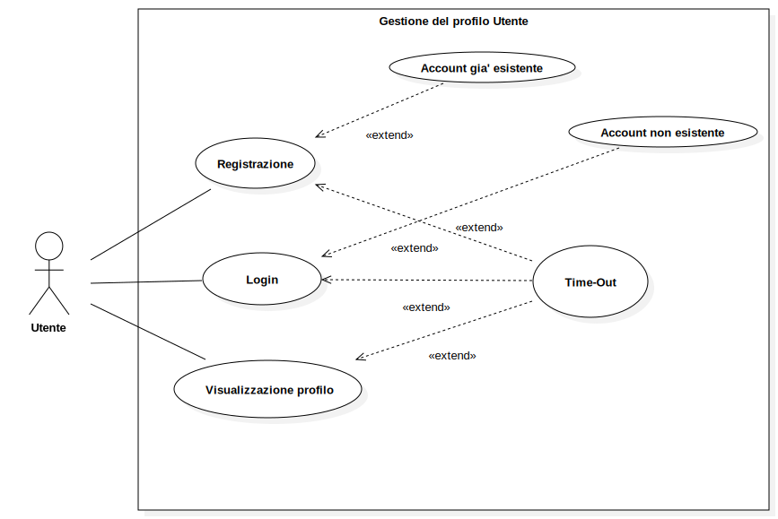

Diagramma casi d'uso Utente

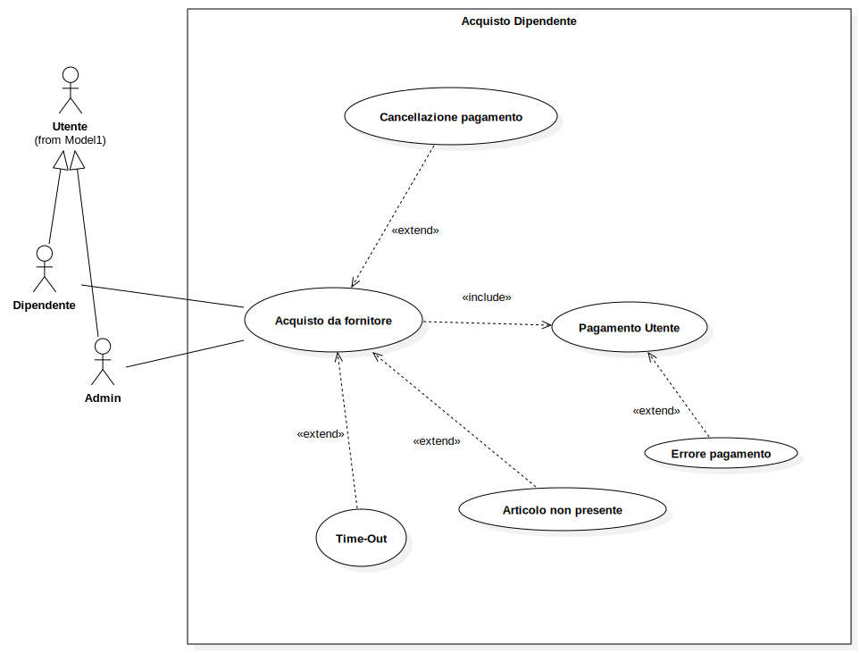

Diagramma casi d'uso Dipendente/Admin

## **Diagramma delle classi iniziale**

Dalla definizione dei casi d'uso si può ricercare una struttura iniziale del sistema, che prevede delle classi per la gestione delle funzioni descritte

### Classi

- Articolo
- Carrello
- Utente (specializzato in base al tipo)
- Rappresentazione del sistema (specializzata in base alla schermata desiderata)
- Pagamento
- Manager gestione del sistema

  

Diagramma delle classi Iniziale

La struttura del sistema sarà composta da queste classi fondamentali, dalle quali si svilupperà tutto l'intorno;  
Prima di arrivare al diagramma delle classi vero e proprio ci sono sicuramente da considerare vari aspetti del sistema come i pattern possibili da seguire e le relazioni tra classi piu' nello specifico.  

## **Pattern**

I pattern sono una soluzione generale (modello) a problemi facenti parte delle stessa classe.  
La descrizione di un pattern dipende da quale caratteristica mette in risalto: strutturale o comportamentale.

### **Model View Controller (MVC)**

Tramite l'uso di questo **pattern architetturale** riusciamo a dividere le 3 componenti fondamentali del sistema.  
Questo porta a diversi vantaggi nella gestione del sistema e nel comportamento dello stesso:
- Logica di lavoro del sistema ben definita
- Maggiore facilità nella fase di scrittura e testing del codice
- Rafforzamento della sicurezza (intermediario tra Utente e dati)

La divisione del sistema avverrà con i ruoli che saranno ricoperti rispettivamente da:
- **Controller** = Manager di gestione del sistema
- **Model** = Dati contenuti nei vari Database e classi del sistema (Es. **Articolo**)
- **View** = Interfaccia di comunicazione del sistema con l'Utente (**Rappresentazione del sistema**)

### **Singleton**

Questo pattern ci assicura che alcune classi del sistema abbiano una e una sola istanza, come ad esempio il **manager utente** che dev'essere uguale per tutte le istanze del sistema

### **Observer**

Observer ci fornisce un modo semplice di gestire gli acquisti e i rifornimenti di articoli a run-time, in quanto le quantità di prodotti disponibili possono cambiare nel poco tempo in cui si decide di acquistare dal sistema  
<!-- observer attaccati a ciascun articolo nel sistema globalmente -->

### **Proxy**

Il pattern Proxy ci permette di avere una maggiore protezione nella fase di acquisto di articoli dal sistema, che sia questa da parte di un cliente o meno, l'utente comunicherà' con una infrastruttura posta a meta' tra il sistema e il circuito bancario, assicurando una maggior sicurezza

### **Memento**

Per permettere un acquisto piu' veloce di articoli già acquistati in precedenza, possiamo utilizzare questo pattern per "ricordare" i carrelli passati, tramite lo storico acquisti del cliente

## **Diagrammi delle classi**

Questi diagrammi forniscono una panoramica del sistema mostrando le sue classi e le loro relazioni.  
In particolare il diagramma delle classi di un singolo software costituisce la base per la costruzione dell'infrastruttura attorno allo stesso, ed e' alla base anche di altri diagrammi, statici e dinamici, che aiutano la comprensione e l'implementazione del prodotto.  

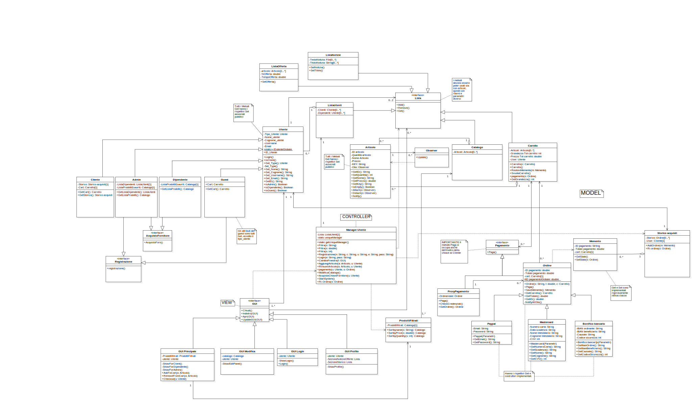

## **Diagrammi delle interazioni**

I diagrammi delle interazioni ci aiutano a vedere come il sistema lavora, mostra cosa fanno le classi nel sistema e come comunicano tra di loro soprattutto

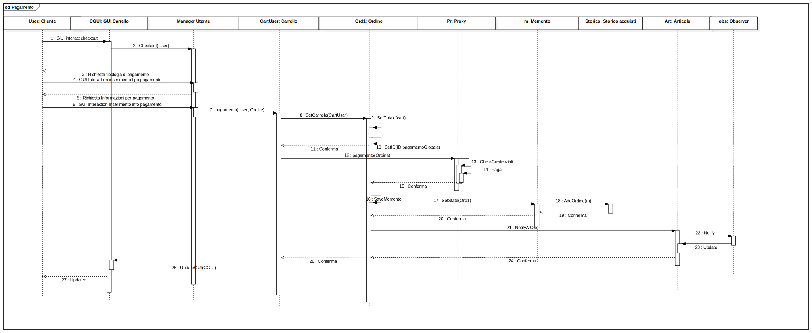

Diagramma delle sequenze: Pagamento

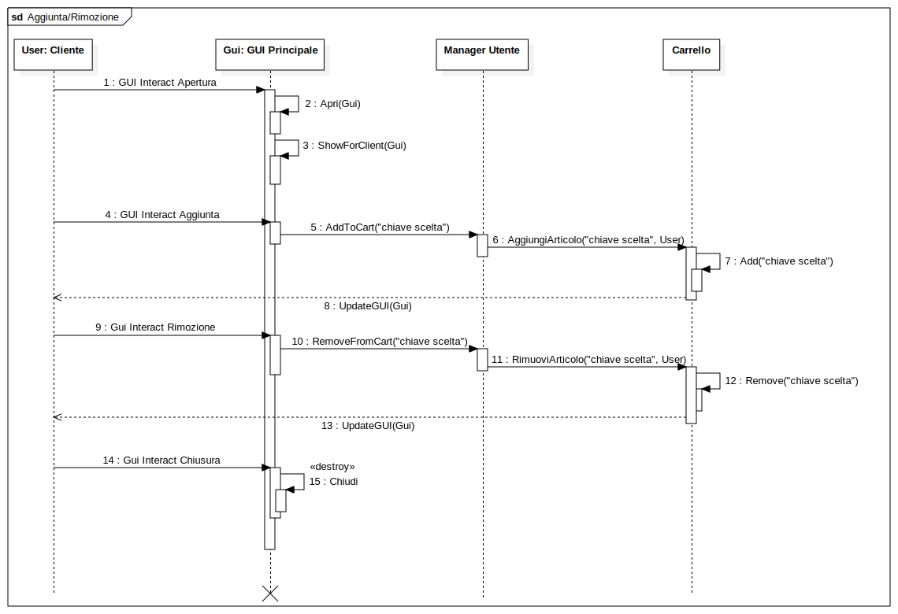

Diagramma delle sequenze: Aggiunta/Rimozione

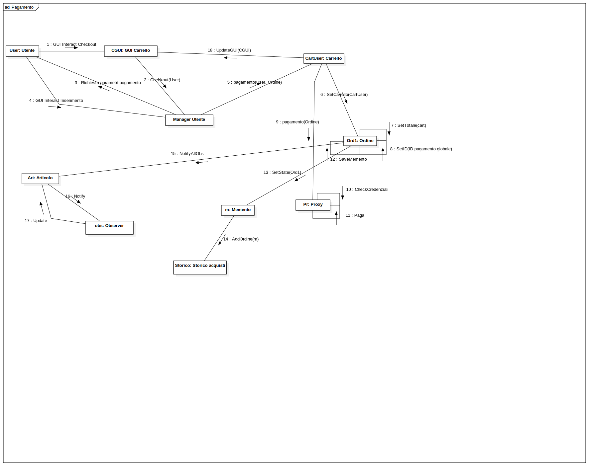

Diagramma delle collaborazioni: Pagamento

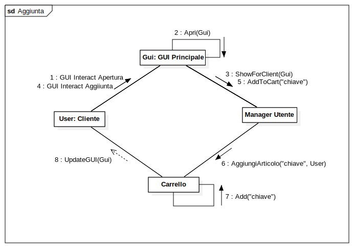

Diagramma delle collaborazioni: Aggiunta

## **Diagrammi delle Attività**

I diagrammi delle attività descrivono il flusso di eventi in un punto specifico del programma, descrivendo meglio anche le scelte possibili che possono essere percorse, in modo simile a un grafo di flusso

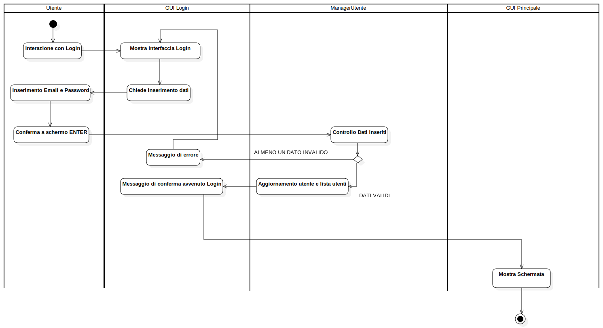

Diagramma delle Attività: Login

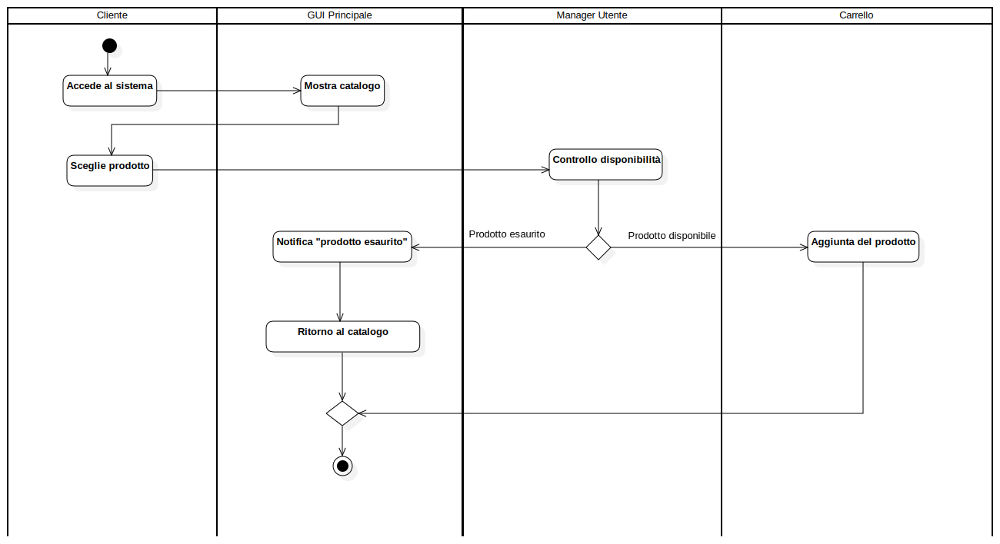

Diagramma delle Attività: Aggiunta al carrello

## **Diagramma dei package**

Il diagramma dei package aiuta a capire ed esprimere meglio le dipendenze tra i vari package di cui e' composto il software, e di conseguenza tra le varie classi, di cui sono composti i package

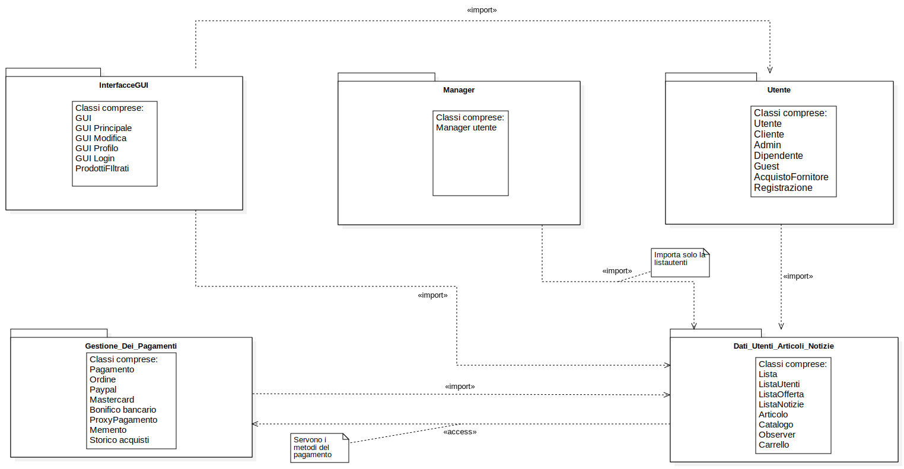

Diagramma dei package

## **Diagramma delle componenti**

Il diagramma delle componenti mostra come le varie parti del sistema si interfacciano tra di loro, ad esempio come l'utente riesce ad interagire con gli articoli presenti nella piattaforma

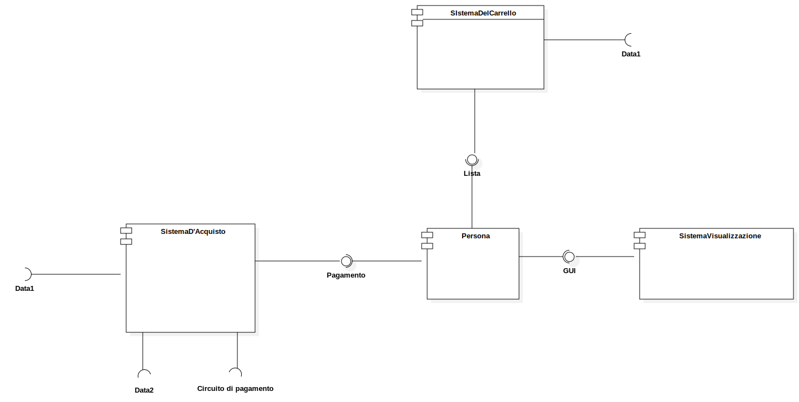

Diagramma delle componenti

## **Diagramma dei deployment**

Il diagramma dei rilasci/deployment mostra l'infrastruttura hardware su cui si poggia il software, e le altre componenti hardware con il quale si può interfacciare e comunicare

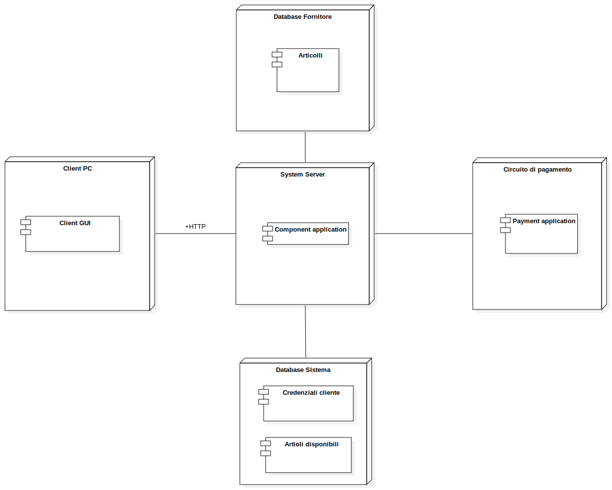

Diagramma dei deployment

## **Diagrammi BPMN**

I diagrammi BPMN aiutano a descrivere un processo all'interno del sistema sotto vari aspetti; infatti il BPMN può essere utilizzato dagli analisti dei processi, sviluppatori dell'implementazione dei processi o anche da stakeholders che vogliono comprendere i processi che mette in gioco la piattaforma

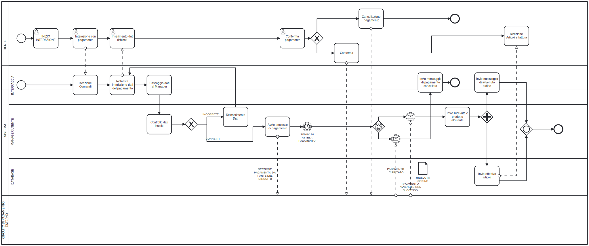

Diagramma BPMN Pagamento

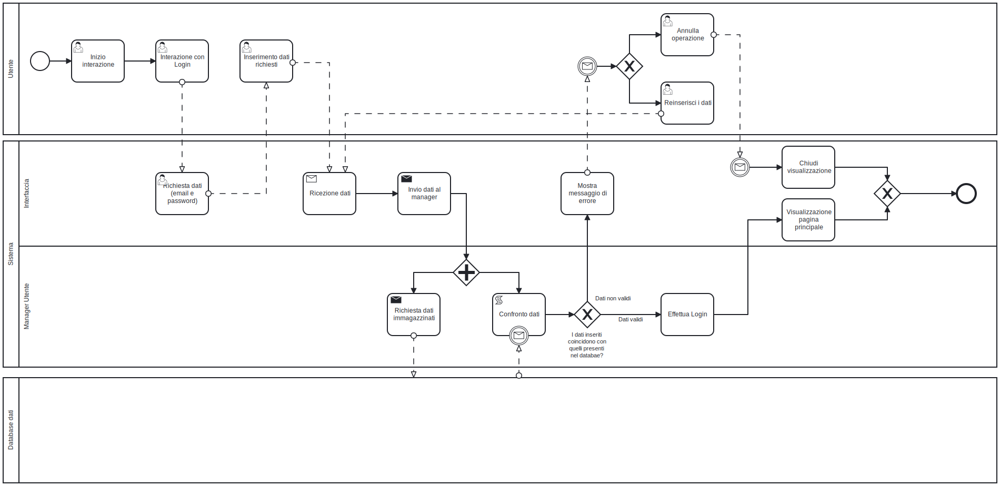

Diagramma BPMN Login

#

## **FASE DI TESTING**

La fase di testing prevede diversi tipi di test che permettono di valutare diversi aspetti del codice, dalle performance in termini di tempo, a quelle di risorse, dalle risposte del sistema in condizioni nominali, a quelle in condizioni di stress; ma prima di questi test piu' approfonditi vi sono i test di unita' e integrazione che testano i singoli moduli al loro interno, e le relazioni con altri moduli che eventualmente richiamano;  
I test che abbiamo effettuato prevedono la verifica di alcune funzioni del carrello, una delle classi principali del sistema, utilizzando anche la classe Articolo anche se definita in modo approssimato rispetto a quello che dovrebbe essere (**stub**).

