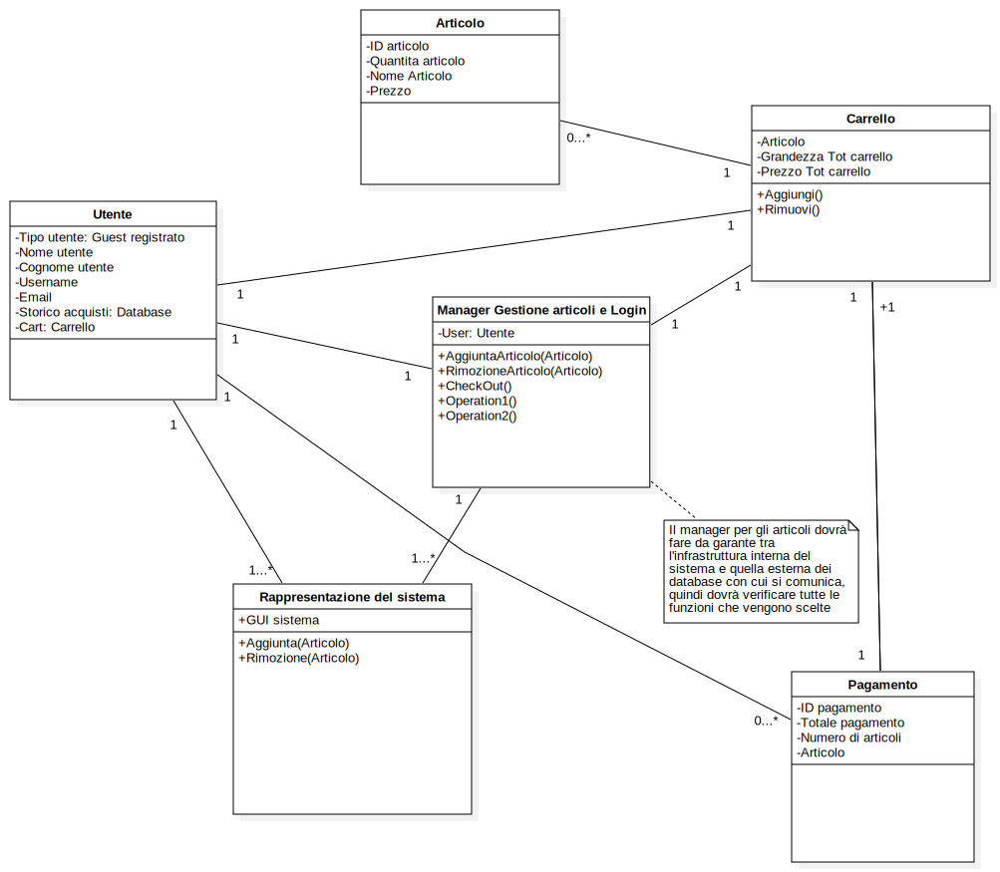

# Progetto E-Commerce di chiavi digitali

## Tecnica di sviluppo software, MODELLO A CASCATA

Nello sviluppo di questo software si utilizza la tecnica del modello a cascata, che parte dalla definizione dei requisiti e delle feature, fino ad arrivare allo sviluppo effettivo del prodotto con conseguente rilascio al cliente.  
In questo caso l'attenzione alla **fase di definizione dei requisiti** e' massima in quanto rappresenta la parte cruciale del progetto, dalla quale si possono propagare gli **errori piu' gravi**, che possono portare a una grande difficolta' nella loro possibile correzione.  

## Breve descrizione

Si vuole realizzare un sistema per la vendita di chiavi digitali tramite un E-Commerce online, che offra un'interfaccia semplice per l'utente riguardo l'acquisto, e ai vari dipendenti per la gestione del magazzino. Quest'ultimo sarà rifornito grazie a un rivenditore terzo che comunica direttamente con sistema

## **FASE DI ANALISI**

## Requisiti funzionali

- Il Sistema deve permettere all'utente di ricercare gli articoli tramite **filtri appositi**
- Il Sistema deve consentire la **registrazione** e il **login** all’Utente.  
- L’Utente deve poter visualizzare lo **storico acquisti**, le **notizie** e le **offerte**
- Il Sistema deve permettere l'acquisto degli articoli sia all'utente **loggato** sia a un **guest**  
- Il Sistema deve mettere a disposizione un meccanismo di gestione degli articoli da comprare (**carrello acquisti**), che viene gestito diversamente a seconda del **tipo di utente**   
- Il sistema deve accettare **metodi di pagamento diversificati** (carta prepagata, carta di debito/credito ecc...).    
- Il dipendente può **modificare il catalogo** del sistema in ogni suo aspetto (**Grafica** e **contenuto**).    
- Il Sistema deve **avvisare** il dipendente nel caso di prodotti esauriti.	<!-- casella prodotti esauriti nella pagina del profilo del dipendente--> 
- Il dipendente deve poter **rifornire** il sistema in base alle **chiavi mancanti**
- L'Admin deve poter rifornire il sistema anche rispetto a **chiavi non presenti** nel sistema
- L'Admin gestisce la registrazione dei vari **dipendenti** nel sistema
- (Per semplicità) Il Fornitore accetta gli stessi metodi di pagamento del Sistema.   

## Requisiti non funzionali

- La transazione deve essere altamente sicura da parte di un qualsiasi utente
- Il prodotto deve essere consegnato in breve tempo (~3 min. max.)
- La piattaforma deve essere funzionante 24/7

## Attori
- Utente
- Dipendente
- Admin
- Fornitore
- Circuiti di pagamento 

## Glossario 
- Data1: Database del sistema con prodotti e credenziali
- Data2: Database fornitore
- Logged: visualizzazione utente registrato
- Manager: visualizzazione dipendente registrato
- Sinonimi: "prodotto", "articolo", chiave digitali"
- Sinonimi: "negozio", "store", "piattaforma"
 
## Casi D'uso
| ID  | Nome caso d'uso | Attori  | Descrizione | Trigger | Precondizioni | Post condizioni  | Eccezioni | Include |
|-----------|-----------|-------------|---------------|-----------------|-----------------|---------------|-----------------|----------------|
| 01  | Modifica rappresentazione sistema     | Utente  | L'utente sfoglia gli articoli e modifica la visione tramite i filtri  |  Interazione dell'utente   |     |  modifica interfaccia visualizzata  |   Time-Out   |        |
|02| Registrazione| Utente| l'utente effettua una nuova registrazione al sistema| Click su pulsante di registrazione| Utente non ancora registrato| Logged | Time-Out, Account già esistente|  |
|03| Login| Utente, Dipendente| L'utente/Dipendente accede al sistema| Click sul pulsante di accesso| Account già esistente| Logged | Time-Out, Account non esistente|  |
|04| Visualizzazione Profilo| Utente| L'utente visualizza informazioni personali e ne può modificare alcune| Click nella sezione Profilo|Logged |  |  Time-Out  |  |
|05| Aggiunta Articolo| Utente| L'utente aggiunge un articolo al carrello| Interazione dell'utente con bottone| | Modifica carrello|  Time-Out, Articolo esaurito|  |
|06| rimozione articolo| Utente| l'utente rimuove un articolo dal carrello| interazione col carrello| almeno un articolo nel carrello| modifica carrello | Time-Out, Articolo non piu presente| |
|07| Pagamento Utente| Utente, Circuito di pagamento| l'utente deve  pagare con un circuito di pagamento a scelta| Interazione utente con procedura di pagamento| almeno un articolo nel carrello| modifica carrello, modifica data1 | Time-Out, errore pagamento, Pagamento cancellato |  |
|08| Modifica sistema| Dipendente| Il Dipendente modifica il catalogo nella grafica e nei contenuti| Accesso ad area di modifica| Logged| Modifica interfaccia sistema e/o data1|Time-Out|  |
|09| Acquisto da fornitore| Dipendente, Admin, Fornitore, Circuito di pagamento| Il Dipendente acquista dal fornitore chiavi digitali| click su bottone|Logged  |Aggiornamento catalogo|Time-Out, Articolo non presente, cancellazione pagamento|   07  |  
|   10    |   Visualizzazione del carrello    |   Utente    |   Rappresentazione degli articoli nel carrello    |   Interazione dell'utente con l'opzione carrello    |    |     |   Time-Out   |      |
|   11  |  Registrazione e cancellazione dipendenti |  Admin   |   Registrazione di nuovi dipendenti al sistema   |    interazione con funzione registrazione  |    Logged    |       |   Time-Out, ID dipendente già presente  |  02    |

### Normal flow dei casi d'uso

### 01

1. L'utente si connette ad internet
2. L'utente cerca il negozio su browser
3. L'utente apre la piattaforma
4. La piattaforma carica la visualizzazione
5. L'utente sceglie il filtro che preferisce per la visualizzazione degli articoli
6. Il sistema ricalcola la visualizzazione degli articoli includendo solo quelli che soddisfano i filtri
7. Il sistema mostra la nuova visualizzazione della piattaforma

### 02

1. La piattaforma ha già caricato la visualizzazione, con o senza filtri
2. L'utente clicca sul bottone di **registrazione**
3. La piattaforma apre una finestra di registrazione in cui sono presenti dei campi da riempire
4. L'utente riempie i campi con le proprie informazioni personali 
  - nome
  - cognome
  - email
  - password
5. L'utente clicca il bottone di **conferma**
6. Il sistema memorizza le informazioni sul Data1
7. Il sistema chiude la finestra di registrazione
8. Il sistema ritorna sulla finestra di visualizzazione articoli come da inizio procedura, aprendo una finestra di **conferma avvenuta registrazione**

#### Alternative flow

6. Il sistema trova una corrispondenza già esistente nel data1
7. Il sistema ripropone la finestra di registrazione
8. Il sistema aggiunge un avviso a schermo che specifica l'esistenza di un profilo con la **stessa mail**
  
### 03

(Attore = Dipendente/Utente) (Il flow per il dipendente è valido anche per l'Admin)
1. La piattaforma ha già caricato la visualizzazione, con o senza filtri
2. L'attore clicca sul bottone **accedi** 
3. Il sistema apre una finestra di accesso con i campi da riempire
4. L'attore inserisce i propri dati nei campi
     - email
     - password
5. Dopo aver premuto **accedi** i campi riempiti vengono mandati al Data1
6. Il Data1 controlla che i dati inseriti siano corretti e fa accedere l'attore al sistema
7. Il sistema chiude la finestra di accesso
8. In base al profilo dell'attore viene mostrata un diversa visualizzazione della piattaforma:
  - Utente -> **Logged** e visualizzazione normale della piattaforma
  - Nuove funzioni:
    - Aggiunta dell'opzione **profilo**
    - **rimozione opzioni di registrazione**-> accedi, registrati
  - Dipendente -> **Manager**, visualizzazione normale della piattaforma
  - Nuove funzioni:
    - Modifica della visualizzazione home page
    - Gestione Inventario
    - Ordine chiavi da fornitore
    - **rimossa opzione** carrello
    - **rimosse opzioni di registrazione**-> accedi, registrati

#### Alternative flow

6. Il sistema non trova riscontro nel data1 rispetto ai dati inseriti
7. Il sistema ripropone la schermata d'accesso
8. Il sistema aggiunge un avviso a schermo che specifica la mancanza di un'account associato alla coppia **mail/password** inserita

### 04

1. L'utente ha già eseguito il login
2. La piattaforma apre la finestra del **profilo**
3. la finestra presenta diverse opzioni
     - **storico acquisti**: Il sistema fa visualizzare una nuova finestra all'utente, in questa sono presenti tutti gli acquisti passati, con le varie informazioni associate (**data acquisto**, **nome articolo**, **prezzo articolo**)
  
    - **notizie e offerte**: Il sistema fa visualizzare una nuova finestra all'utente, in questa vi sono tutte le notizie riguardanti nuovi articoli presenti nella piattaforma e offerte sui prodotti disponibili in quel momento
  
    - **modifica informazioni personali**: Il sistema fa visualizzare una nuova finestra all'utente, nella quale sono presenti diversi bottoni con cui l'utente può interagire, che permettono di cambiare alcune informazioni personali(**password**, **indirizzo di fatturazione**, **metodi di pagamento**)
4. una volta aperta la rispettiva finestra questa presenta un opzione per tornare indietro alla pagina del profilo

### 05

1. La piattaforma ha già caricato la visualizzazione, con o senza filtri
2. a questo punto l'utente sceglie l'articolo che vuole aggiungere al carrello
3. l'utente interagisce col bottone **aggiungi al carrello**
4. Il sistema comunica col **data1** per controllare la disponibilità dell'articolo
5. viene confermata la disponibilità da parte del data1
6. Il sistema aggiorna la visualizzazione dell'utente modificando l'icona del carrello ed il suo contenuto

#### Alternative flow

5. non viene confermata la disponibilità da parte del data1
6. Il sistema aggiorna la visualizzazione dell'utente modificando l'etichetta dell'articolo in questione

### 06

1. L'utente, tramite la relativa icona, accede alla **visualizzazione del carrello**
2. l'utente sceglie l'articolo da rimuovere e interagisce col bottone **rimuovi**
3. Il sistema aggiorna la visualizzazione del carrello ed il su contenuto rimuovendo l'articolo in questione e mantenendone eventuali altri

### 07 (c'è anche l'alternative flow)

1. L'utente, tramite apposita icona, accede sezione **carrello**
2. L'utente procede all'acquisto tramite bottone dedicato
3. Viene mostrata una finestra con tutti i metodi di pagamento disponibili
4. L'utente ne sceglie uno
5. Vengono mostrati i campi da riempire con le relative informazioni
6. L'utente inserisce i dati
7. Il circuito di pagamento verifica la correttezza dei dati:
     - In caso negativo lo notifica al sistema che ne permette il reinserimento
     - In caso affermativo processa la transazione
8. Il circuito di pagamento verifica il saldo disponibile:
     - Se è sufficiente, il circuito di pagamento conferma la transazione detraendo la somma in questione e lo notifica al sistema che si occupa di inviare i/il prodotti/o al cliente
     - Se non è sufficiente, il circuito di pagamento lo notifica al sistema che visualizza una finestra apposita; l'utente viene reindirizzato alla scelta dei metodi di pagamento
9. Dopo l'acquisto l'utente viene riportato alla schermata del carrello
10. Il data1 viene aggiornato in base ai prodotti che sono stati acquistati e quindi vengono eliminati da quelli disponibili

### 08

1. Il Dipendente si collega al negozio tramite browser
2. Il sistema mostra la visualizzazione normale
3. Il Dipendente accede con le proprie credenziali tramite il bottone **Accedi**
4. Il sistema riconosce il Dipendente dalle credenziali inserite
5. Viene mostrata la visualizzazione **Manager** dello store
6. il dipendente entra nella sezione di **Modifica** tramite apposito bottone
7. Vengono mostrate nuove opzioni:
  - Modifica prodotti disponibili (prezzo, quantità E rimozione)
  - Aggiunta nuovi prodotti
  - Modifica grafica del negozio
8. In base alle modifiche apportate viene modificato data1
9. Al termine delle modifiche viene visualizzata un'anteprima dello store

### 09

1. Dopo ogni transazione viene effettuato un controllo
2. Il sistema verifica lo stato dei prodotti (tramite apposite etichette)
3. Il sistema notifica all'Dipendente i prodotti non più disponibili aggiungendo un messaggio con la lista completa nella sezione dedicata

### 10

Utente = Dipendente/Admin
1. L'utente ha già effettuato l'accesso
2. L'utente viene reindirizzato al data2 tramite apposito bottone presente nella visualizzazione Manager
3. A seconda del tipo di utente sono presenti diverse opzioni:
   - Dipendente: possono essere riforniti gli articoli già presenti nel sistema
   - Admin: oltre a poter rifornire gli articoli già presenti è possibile acquistarne di nuovi
4. L'utente sceglie quali prodotti acquistare
5. L'utente sceglie il metodo di pagamento
6. L'utente inserisce i dati di pagamento
7. Il circuito di pagamento processa la transazione
8. Il circuito di pagamento notifica l'avvenuta transazione al sistema
9.  Il sistema aggiorna il data1 con i nuovi prodotti
10. Il data2 viene aggiornato (modifica etichetta relativa alla quantità dei prodotti)
11. Al termine del processo, IlDipendente viene reindirizzato alla visualizzazione del data2

### 11

1. L'utente interagisce con l'opzione carrello a partire dalla visualizzazione normale 
2. Il sistema apre la finestra del carrello, questa contiene
  - visualizzazione degli articoli con relativa quantità
  - opzione di rimozione degli articoli, per ogni articolo
  - opzione di pagamento degli articoli presenti nel carrello
3. L'utente può interagire con ognuna delle opzioni presenti
4. L'utente può decidere di tornare alla visualizzazione precedente tramite la relativa opzione

### 12

#### 12.registrazione

1. L'admin accede alla sua area personale
2. L'admin interagisce con il bottone per la registrazione di nuovi dipendenti al sistema
3. Il sistema richiede di inserire le informazioni personali del dipendente, oltre al **nome utente** e la **password** che dovrà successivamente utilizzare
4. Dopo una verifica del sistema dei dati inseriti dall'admin il nuovo profilo viene creato
5. Il sistema riporta l'admin alla schermata del suo profilo e crea una finestra con il messaggio di avvenuta registrazione

#### 12.Delezione

1. L'admin accede alla sua area personale
2. L'admin interagisce con il bottone per la delezione di un profilo dalla piattaforma (che sia di un utente o un dipendente)
3. Il sistema offre una barra di ricerca all'admin, con cui potrà ricercare il profilo da eliminare, tramite **email** o **nome utente**
4. Il sistema gli presenta una lista dei riscontri che ha avuto in base alle informazioni inserite
5. L'admin sceglie l'account con opportuna interazione tramite bottone
6. Il sistema elimina definitivamente il profilo dal data1
7. Il sistema riporta l'admin alla schermata del suo profilo e crea una finestra con il messaggio di avvenuta delezione

## (Schizzo per la progettazione)

### Classi

- Articolo
- Carrello
- Utente (specializzato in base al tipo)
- Rappresentazione del sistema (specializzata in base alla schermata desiderata)
- Pagamento
- Manager gestione dei filtri
- Manager modifica del sistema
- Manager gestione articoli (aggiunta, rimozione, etc..)

  

La struttura del sistema sarà composta da queste classi fondamentali, dalle quali si svilupperà tutto l'intorno;  
La visione scelta in questo caso è sicuramente quella dell'Utente/Compratore;  
Prima di arrivare al diagramma delle classi vero e proprio ci sono sicuramente da considerare vari aspetti del sistema come i pattern possibili da seguire e le relazioni tra classi piu' nello specifico.  

## **FASE DI PROGETTAZIONE**

### Model View Controller (MVC)

Tramite l'uso di questo **pattern architetturale** riusciamo a dividere le 3 componenti fondamentali del sistema.  
Questo porta a diversi vantaggi nella gestione del sistema e nel comportamento dello stesso:
- Logica di lavoro del sistema ben definita
- Maggiore facilità nella fase di scrittura e testing del codice
- Rafforzamento della sicurezza (intermediario tra Utente e dati)

La divisione del sistema avverrà con i ruoli che saranno ricoperti rispettivamente da:
- **Controller** = Manager di gestione vari del sistema
- **Model** = Dati contenuti nei vari Database e classi del sistema (Es. **Articolo**)
- **View** = Interfaccia di comunicazione del sistema con l'Utente (**Rappresentazione del sistema**)

### Factory method

Questo **pattern di design** 

